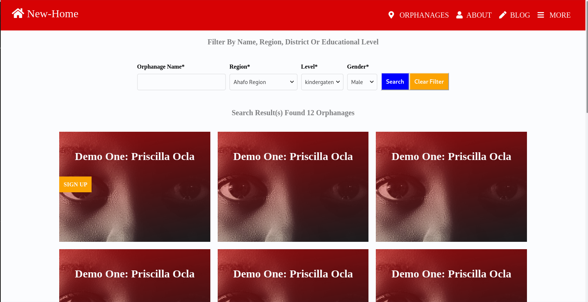
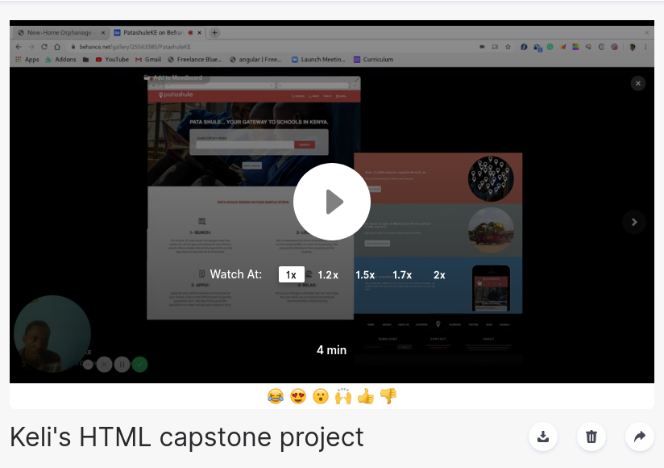

# Capstone HTML project ([The microverse capstone project](microverse.org))

This is the Microverse capstone project of the Main HTML/CSS curriculum at [Microverse](https:www.microverse.org/) - @microverseinc. 

It is a fun page I design with html and sass and css based on the ([Mathew Njuguna designs](https://www.behance.net/mathewnjuguna)) designs: 
It has a search result page.
A sign up page.
A homepage. 
Every page is responsive and changes based on the content of the page.
IT is build solely with html and css no grid at all.

## Built With

- HTML5 
- CSS3

## Live Demo

[Live Demo Link](https://goofy-hopper-c53e91.netlify.com/)

## Author

👤 **Kelly Booster**

- Github: [@kelibst](https://github.com/kelibst)
- Twitter: [@keli_booster](https://twitter.com/keli_booster)
- Linkedin: [Kekeli (Jiresse) Dogbevi
](https://www.linkedin.com/in/kekeli-dogbevi-958272108/)

## 📝 License

This project is [MIT](https://opensource.org/licenses/MIT) licensed.

